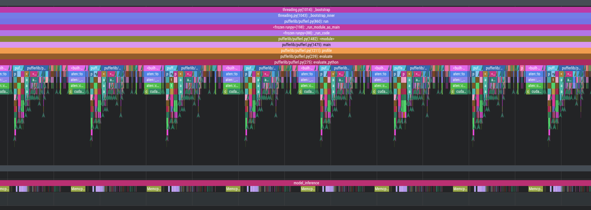
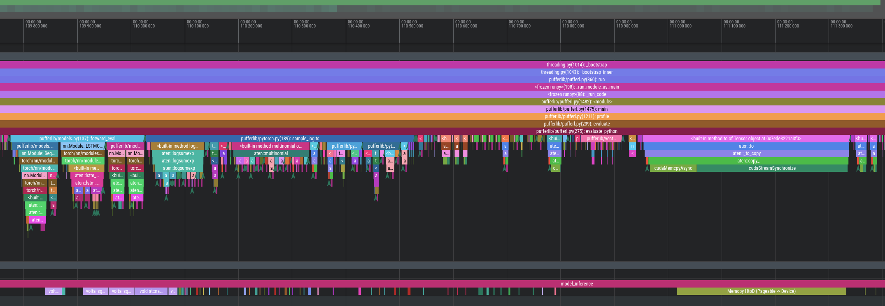

## Multithreaded Libtorch fork of PufferLib 
 Main repo: https://github.com/pufferai/pufferlib

> 
>**DO NOT USE THIS YET** 
>
> Still in-progress. Go to https://puffer.ai  or the main repo https://github.com/pufferai/pufferlib
>
 

This repo contains a C++-native version of `evaluate` that uses libtorch + CUDA streams + threads to sub-linearly scale the core `eval<->train` loop.

## Native Multithreading + Libtorch `evaluate`

Key improvements:
- Multi-threaded `copy obs to GPU` in batches (chunk size configurable based on GPU<-> bandwidth)
  - Use one CUDA stream per batch
  - Batches accrue segments across an horizon independently from each other. 
    - Segments proceed linearly but parts of it are run async
- Each batch then runs the forward pass to obtain actions/logprobs/values etc.
- Multithreaded batched env `step` (utilizes all cores)
- Each batch independently transfers actions/logprobs/values from CPU to GPU per-segment using a per-segment / per-batch stream.

## Analysis

Running Multiprocess RL `evaluate` looks something like this:

This shows the main process obtains observations from the vector environments, running a forward pass, generating actions.
(The sub-process is not visible here). It's pretty sequential (one environment at a time), and the environments run one by one too (not shown here).

Note that as part of a BPTT horizon with `H` segments, each segment runs `N` environments. Segment $H_i$ must precede $H_{i+1}$.
            
Here is a zoomed-in view of the `copy obs to GPU`, `run forward pass`, `sample logits/actions` :

## Speed ups

TODO: Training loop spends 90% of the time in raw forward/learn which is pure libtorch already. Probably hit the Amdahl limit on how much optimization can happen here? unless we improve the core policy itself (MinGRU?)

