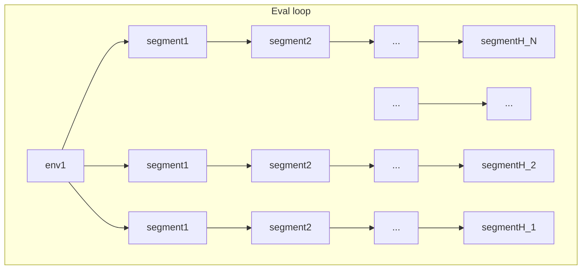
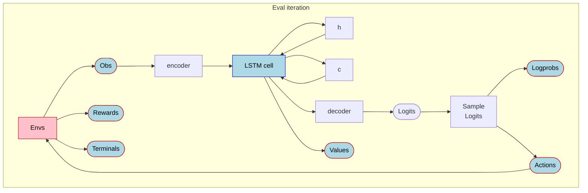

## Multithreaded Libtorch fork of PufferLib 
 Main repo: https://github.com/pufferai/pufferlib

> 
>**DO NOT USE THIS YET** 
>
> Still in-progress. Go to https://puffer.ai  or the main repo https://github.com/pufferai/pufferlib
>
 

This repo contains a C++-native version of `evaluate` that uses libtorch + CUDA streams + threads to sub-linearly scale the core `eval<->train` loop.

Comparison between the previous Multiprocessing backend (2 procs) and the native multithreading backened (using 8 CUDA threads/12 env threads) using the same number of envs/steps/etc:


| Game/Env    | 2080 RTX         |                   | 4090 RTX         |                   |  
|-------------|:----------------:|:-----------------:|:----------------:|:-----------------:|
|             | **MultiProc**        | **NativeMT**            | **MultiProc**          | **NativeMT**          |
| go          | 580K SPS           | 1.8M SPS          |  794K SPS          |    1.8M SPS      | 
| breakout    | 1.2M SPS           | 4.5M SPS          |  3.9M SPS          | 6.1M SPS        |
| pong      | 1M   SPS           | 3M SPS            |  3.2M SPS            | 6.2M SPS               |


* I used 4090 RTX from Puffer/Joseph's lab. `runpod/vast.ai` 4090RTX etc have terrible cuda launch latencies (~4-6x slower) and not useful for RL training.

Some more data on just the 2080RTX card:
| Game/Env    | 2080 RTX         |                   |   |
|-------------|:----------------:|:-----------------:|:--:|
|             | **MultiProc**        | **NativeMT**            | _Notes_|
| g2048       |   2M SPS                 |  **1M SPS**                |   Much slower because `uint8_t` obs vs `float32` obs / 4x bandwidth (haven't supported uint8 yet) |
| pacman      | 1.5M   SPS           | 2.9M SPS            | |
| rlplays     | 25K  SPS           | 130K SPS          | Large GPU batch + 'fat' env (will open-source once cleaned up) | 


**`Evaluate loop` optimization notes**


- **Independent Multithreading for GPU batches and envs**
  - GPU Batches: ~8 batches each with its own CUDA stream (depends on the GPU / GPU bandwidth).
    * Multi-threaded GPU batching that overlaps copies, GPU ops where a horizon is split into individual segments that proceed forward sequentially but in parallel to other batches' horizons.
    * HostToDevice copy (obs/rewards/terminals) and DeviceToHost copy (actions/logprobs). 
    * GPU copies across different batches proceed in parallel to GPU ops, both of which are in parallel to the envs.
    * This is different from the Multiprocessing backend: __Each batch/segment in a horizon proceeds sequentially but in parallel to other batches/segments.__
  - Env batches: ~12-16 (depending on the CPU)
    * The Env and GPU threads are separate (with different priorities).
    * 'Fat envs' such as go (or my pixel platformer) benefit a lot just from these two batching.
    * May need an autotune for the GPU/env batch sizes but  8 GPU batches/threads + 12-16 env batches/threads is a good pareto frontier number.
  - Both thread groups/batches have exactly one lock per batch. 
    * Per-env/gpu ops cost (inside a batch) is order of magnitude lower as there it's completely lock/atomics free (tight loop).
- **Fused kernels with out params**
  - Uses 2 tuned kernels for LSTM network along with the `_out` version of the libtorch lstm cell (only discrete actions so far)
  - Preallocated tensors filled via out params
    * Obviate the need for cuda graphs (see below for why)
    * No tensor allocs during `evaluate` loop
    * Avoids bad CUDA caching allocator problems especially with multiple streams/threads (see below)
  - Reduced from **~52 cuda launch kernels + 9 memcpy/memallocs** down to total **9 launches + 2 copies** (HtoD obs/DtoH actions)
    * For example, the `sample logits` did a bunch of tensor manipulation, sampling etc with many ops. The new version is a single CUDA kernel that outputs logprobs + actions to two (prealloc'ed) output tensors
  - I tried different versions (tried the internal libtorch `_out` functions, their own CUDA kernels) before settling on these three cuda kernels.
    * One nice side-effect is that the cuda kernels are closer to the real puffernet one (e.g. gelu approximation) rather than the full lstm kernel in `models.py`.

- **Preallocated tensors**
  - Entire horizon is preallocated with the correct output tensors
  - Very minimal mallocs (CPU-side) and zero tensor allocs during the core evaluate loop
  - A preallocated random tensor for sampling discrete actions as `uniform_` calls are very expensive to run as part of CUDA. (GPUs have minimal PRNG capability esp. with SIMT)
  - Setup/teardown cost for a full horizon run is very minimal (~1ms on 2080RTX)

- **Maintain parity with existing PufferLib**
  - Supports incremental turning on/off of different features:
    - Maintains full parity existing `Multiprocessing` backend via `evaluate_python`
    - Add just the new `Multithreading` backend with existing PyTorch `evaluate_python` (no native C++ libtorch code) `enable_native_libtorch=0`
    - Add native libtorch with `enable_native_libtorch=0` with configurable GPU batches `num_gpu_batches` /env batches `max_num_threads` 
    - Experimental (not recommended) CUDA graph mode using `use_cuda_graphs = 1`

This new approach has been verified with full eval->train on breakout, go, pacman and my pixel platformer env with stable perf (i.e. final RL perf/score). 


****

**Misc/Tools**
 - Added `scripts/test_cuda_perf.py` to test out bandwidth/FLOPs/launch kernel costs. Quick-n-dirty benchmarks when testing out on a vast.ai/runpod.io machine for comparison purposes.
 - Added `scripts/start_profile_env.sh` to profile multiple envs including the full/partial eval/train loop:
   - Profile just eval or eval+train with different `--vec.backend` etc CLI params.
   - (Optional) Outputs the CUDA profile (.json-> ui.perfetto.dev) along with useful stats into a text file.


 - Misc stuff  
   - Single threaded mode (non-multi-threaded version for debugging via `#define PUFFER_SINGLE_THREADED 1`)
   - 'cuda memcheck' mode in C++ that outputs which of 'our' tensors are being cached by the CUDA caching allocator `#define PUFFER_CUDA_MEMCHECK 1`
   - Micro benchmarks (see `PerfTimer`) + tensor comparisons inside the core C++ code to test stability and performance with realistic data/harness.
   - Timing etc wired up to the main python-side so the dashboard/profile all work seamlessly. 


****

**Detailed notes on optimization**

Quick Recap: Each iteration of the Puffer RL loop does `evaluate` first followed by `train`. `train` generates the neural network parameters for the evaluate to run the envs with.

The core eval loop looks like this:





Each eval iteration collects a _horizon_ of `H` BPTT (back-prop through time) segments. Typically `H` is a nice power-of-2 number like 64. Each horizon's segments runs through this forward->actions->logits->run_envs loops sequentially. Each segment runs/collects `N` environments' observations/actions/rewards/terminals (a segment looks like this expanded out):



<br/>
The forward pass in Puffer uses an LSTM network (typically 128x128 h/c configuration). For (multi)discrete envs such as `breakout`, the forward pass produces a `value` and `logits` the latter of which can be sampled from into `actions` fed into the envs.

The existing Puffer `multiprocessing` backend performed parallel running of envs + forward loop inside `eval` (double-buffered env runs while the GPU does the forward pass). The envs are written in C, the eval/training code is in Python/PyTorch (with a custom CUDA kernel for the PPO advantage function).

With the recap setup, let's dig into the profile to look for optimizations in the `eval` loop (`train` is a different kind of beast, we will explore that at a later date).
All profiles/notes are for `puffer_breakout` running on a machine with 4090 RTX.

First off, the multiprocessing backend looks like this under the profiler:

<details>
<summary>Profiler notes</summary>

I added this script (in PufferLib/scripts) to profile envs with different backends/train/eval loops etc that also produces detailed timing info both from within the Py/C code as well as from CUDA.
```
bash scripts/profile_envs.sh puffer_breakout --profile.train 0 --profile.trace 1 --vec.backend Multiprocessing --profile.name multiprocessing
# Tip: You can provide multiple envs separated by comma e.g. puffer_breakout,puffer_go
```

This also uses the pytorch profiler to generate a .json file you can open with [Perfetto](https://ui.perfetto.dev/) - we will use this perfetto snapshots extensively to analyze performance (compute/bandwidth/memory).
</details>

<br/>


This shows the eval loop running 64 segments sequentially (`forward pass`+`run_envs`) taking 143 ms on a 4090 RTX machine for the [`puffer_breakout`](https://puffer.ai/game.html) env (`~2.23ms` per horizon).

Let's zoom in a bit into the forward+sample_logits parts to analyze the trace for (a) what takes the most time (b) where to optimize:

Here is the forward pass for a single segment (with 4096 environments) (takes `~204us`).


Here is the sample logits based on the output of the forward pass (takes `~304us`)


As the environment generates obs, we have to transfer them to the GPU to run the forward pass with to generate logits/logprobs/values (takes `~196us`).


Current tally: Eval full horizon takes **~143ms** per eval loop iteration.

| Multiproc Eval breakdown for<br/>puffer_breakout on 4090RTX | Time| Notes |
|-------------|:----------------:|:---|
| Copy Host-To-Device <br/>*Obs/Rewards/Terminals*      | `217 us` |  `~195 us` (obs) + <br/>`~22 us` (rewards/terminals)|
| Encoder                 | `64 us` |  |
| Forward<br/>*LSTM*      | `60 us` |  |

| *Total (per segment)*   | `2234 us` | * 64 segments = 143ms per horizon|


Let's look at a series of optimizations now that we have measured/analyzed the perf traces:


**Optimization 1: Multi-threaded environments**

Each horizon runs H segments sequentially. Each segment runs N environments. We can parallelize the N environments


<details>
<summary>Test</summary>
Testing
</details>


**Appendix**

**Why not CUDA graphs?**
 - CUDA graphs help eliminate multiple `launch kernel` costs.
 - However, based on experimentation, I found that it doesn't meet our needs:
   - Requires copying data (even if it's DeviceToDevice for obs, it's a lot).
   - `cudaMemcpyAsync` has a similar cost to `launch kernel`
 - The cost + complicated nature to get the same perf as a few cuda kernel launches obviates their need.

**CUDA Caching allocator problems**
  - With multiple streams+threads, the caching allocator maintains large `Tensor` allocs for a very long time even past a horizon. 
  - We run out of GPU memory or worse fragmented sections resulting in bad perf
  - Even with combinations of hacky flags proposed by pytorch docs such as `PYTORCH_CUDA_ALLOC_CONF=expandable_segments:True` (and others) it OOMs pretty fast
