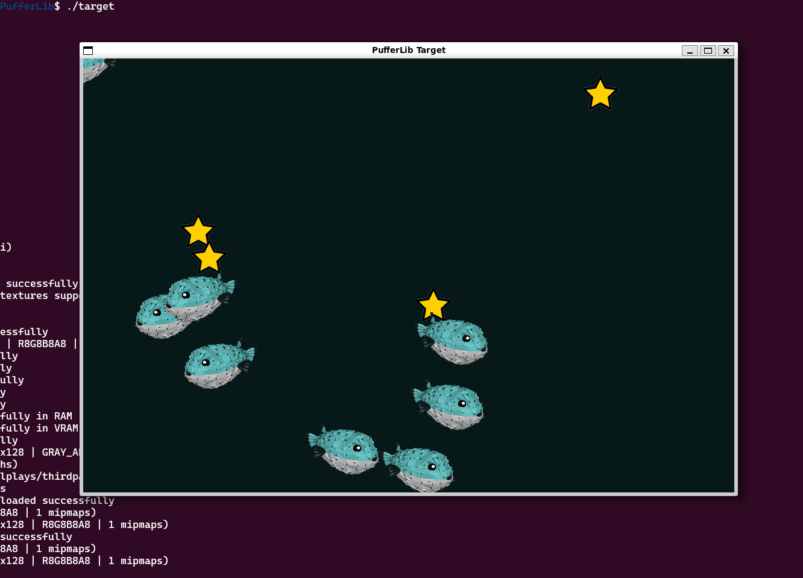

# Swimming in the Ocean

Ocean lets you build C environments with some binding Python glue to train/eval using PufferLib.
Once you train the models, the exported weights can then be used by the C environment with only the `puffer_net.h` dependency.

As always, follow the docs in [the official docs](https://puffer.ai/docs.html). 

This doc is aimed more towards folks unfamiliar with Python/research environments and for those using raw source instead of prebuilt images/Docker.


### Quick notes

- Use a physical Linux machine if possible (HyperV/VM might be hard to configure - but you can get it to work). WSL on Windows works fine.
- Do not use `conda` as it slows down. Use venv:

```
cd PufferLib
python -m venv puffenv
source puffenv/bin/activate

# To deactivate, run `deactivate` to pop out of venv
```


## Try a built-in Ocean environment first

### Compile/run raw demo  - `Target`

On Ubuntu/WSL (tested on Ubuntu 22.04 but 24 should be fine too):

```sh
bash scripts/build_ocean.sh target
./target
```

...should show a [raylib](https://raylib.com) window with puffer fish eating the stars.



## Train and eval the agent using PufferLib

Next, build pufferlib from source and train/eval the

```sh
pip install -e .
# Clear the pip cache if needed `pip cache dir` and remove that dir.

# Then use Ocean envs
python setup.py build_ext --inplace --force

# Should take about 2 mins on our machine.
python -m pufferlib.pufferl train puffer_target --train.device cuda

python -m pufferlib.pufferl eval puffer_target --train.device cuda --load-model-path latest

```

Tip: If `--train.device cuda` doesn't work, try `--train.device cpu`. It's much slower but it's a good start. However, it's highly recommended to using a graphics card to train.

Notes:
- [target.py](../pufferlib/ocean/target/target.py) is used by the train/eval with [binding.c](../pufferlib/ocean/target/binding.c) that interfaces with the actual environment in [target.h](../pufferlib/ocean/target/target.h).
- [target.c](../pufferlib/ocean/target/target.c) is a pure demo-only code. This is the code you will use to load the model but not used during train/eval steps. Likely the part that you can 'ship' publicly.

## Try the raw demo using the weights

Now you are ready to use the model trained / eval'ed earlier:

```sh

```


## Build an Ocean environment